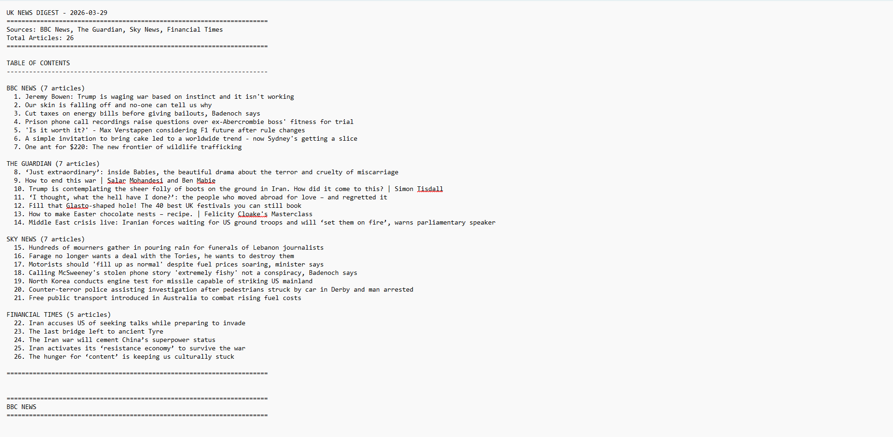
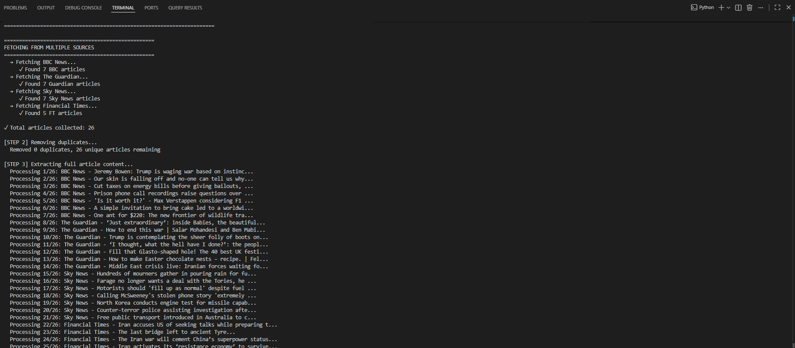
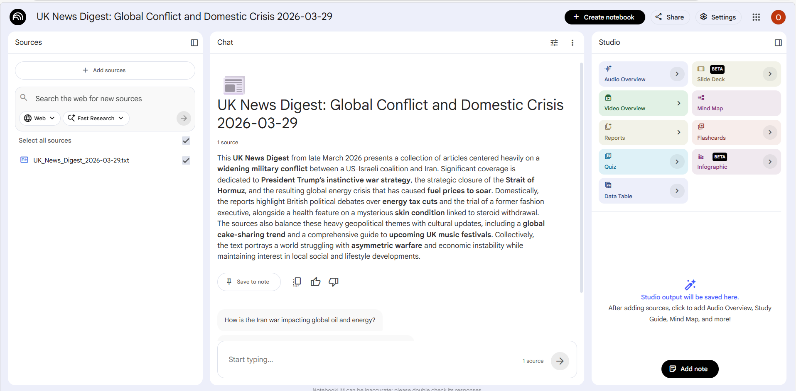
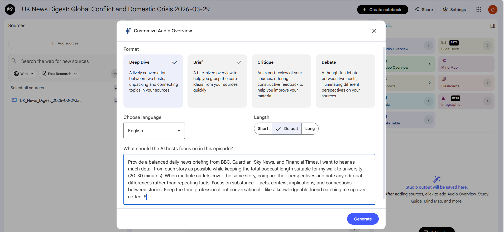
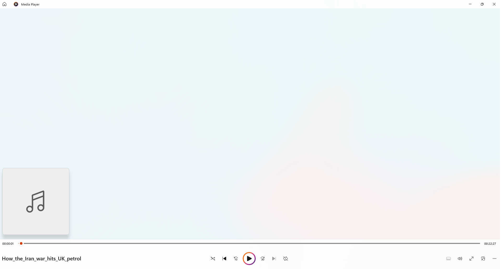

# UK News Aggregator

A Python automation tool that scrapes articles from four major UK news 
sources, compiles them into a structured daily digest, and pipes the 
output into Google NotebookLM to generate a personalised AI podcast 
which ready to listen to on the walk to university.

---

## What it does

Manually keeping up with news across multiple outlets is time-consuming 
and inconsistent. This tool automates the entire pipeline:

1. Fetches the top articles from BBC News, The Guardian, Sky News 
   and the Financial Times 
2. Extracts full article content via web scraping
3. Removes cross-source duplicates
4. Compiles everything into a structured, dated digest file
5. Opens NotebookLM automatically and copies a custom prompt to clipboard
6. The digest is uploaded to NotebookLM which generates a 20–30 minute 
   AI podcast summarising the day's news

Run automatically every morning at 9AM via Windows Task Scheduler - 
no manual trigger required.

---

## Pipeline
```
RSS Feeds (BBC · Guardian · Sky News · FT)
        ↓
feedparser - headline and metadata extraction
        ↓
requests + BeautifulSoup - full article content scraping
        ↓
Duplicate removal - title similarity matching
        ↓
Structured .txt digest - organised by source with table of contents
        ↓
NotebookLM - AI audio overview generation (20–30 min podcast)
```

---

## Tech Stack

| Layer | Technology |
|---|---|
| Language | Python |
| RSS Parsing | feedparser |
| Web Scraping | requests, BeautifulSoup4 |
| File I/O | os, datetime (stdlib) |
| Clipboard | pyperclip |
| Launcher | Windows batch script (.bat) |
| Scheduling | Windows Task Scheduler |
| Output | Structured .txt digest → NotebookLM AI podcast |

---

## Key Features

- Pulls from 4 sources simultaneously - BBC (7), Guardian (7), 
  Sky News (7), Financial Times (5)
- Source-specific scraping logic for each outlet's HTML structure
- Graceful fallback to RSS summary if full content unavailable
- Cross-source duplicate detection via title normalisation
- Structured output with table of contents organised by source
- Auto-opens NotebookLM and copies custom podcast prompt to clipboard
- Runs automatically every morning at 9AM - no manual trigger required
- Polite scraping with 0.5s delay between requests

---

## Output Format

Each digest is a dated `.txt` file structured as:
```
UK NEWS DIGEST - 2026-03-29
==============================
Sources: BBC News, The Guardian, Sky News, Financial Times
Total Articles: 26

TABLE OF CONTENTS
BBC NEWS (7 articles)
  1. Article title...
  ...
THE GUARDIAN (7 articles)
  8. Article title...
  ...

==============================
[Full articles organised by source]
```

---

## Automated Daily Scheduling

The script runs automatically every morning at 9AM via Windows Task 
Scheduler - no manual trigger required. The `.bat` launcher is 
configured as the scheduled task action, meaning the full pipeline 
from fetch to NotebookLM runs hands-free every day.
```bat
@echo off
cd /d "C:\Users\username\Documents\News Digests"
python bbc_article_scraper.py
pause
```

---

## NotebookLM Integration

The digest is uploaded to NotebookLM as a single source. A custom 
prompt is automatically copied to clipboard for the Audio Overview:

> *"Provide a balanced daily news briefing from BBC, Guardian, Sky News, 
> and Financial Times. I want to hear as much detail from each story as 
> possible while keeping the total podcast length suitable for my walk 
> to university (20–30 minutes). When multiple outlets cover the same 
> story, compare their perspectives and note any editorial differences 
> rather than repeating facts..."*

This produces a conversational AI podcast comparing editorial angles 
across outlets rather than simply repeating facts.

---

## Screenshots

### Output digest - table of contents (26 articles, 4 sources)


### Terminal - live scraping progress across all sources


### NotebookLM - digest uploaded and summarised


### NotebookLM - custom Audio Overview prompt


### Generated podcast playing (22 minutes)


---

## Skills Demonstrated

- Multi-source web scraping with source-specific parsing logic
- RSS feed parsing and content aggregation
- Duplicate detection and data cleaning
- File I/O and structured document generation
- Workflow automation - end-to-end pipeline from fetch to podcast
- Windows Task Scheduler integration for daily automated execution
- Practical personal tooling built to solve a real daily problem
